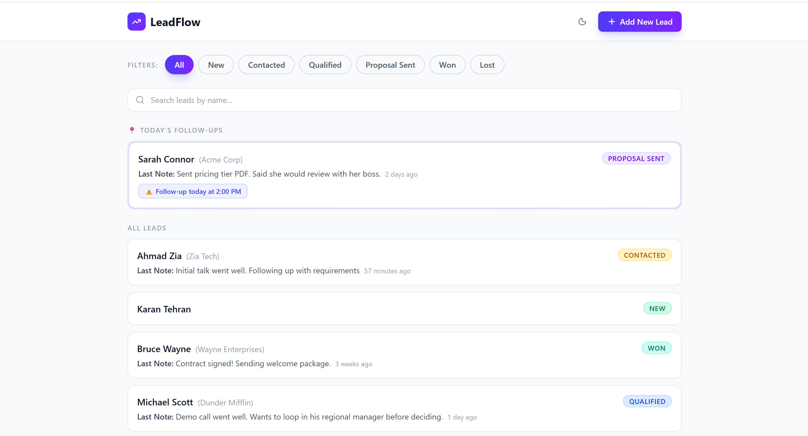
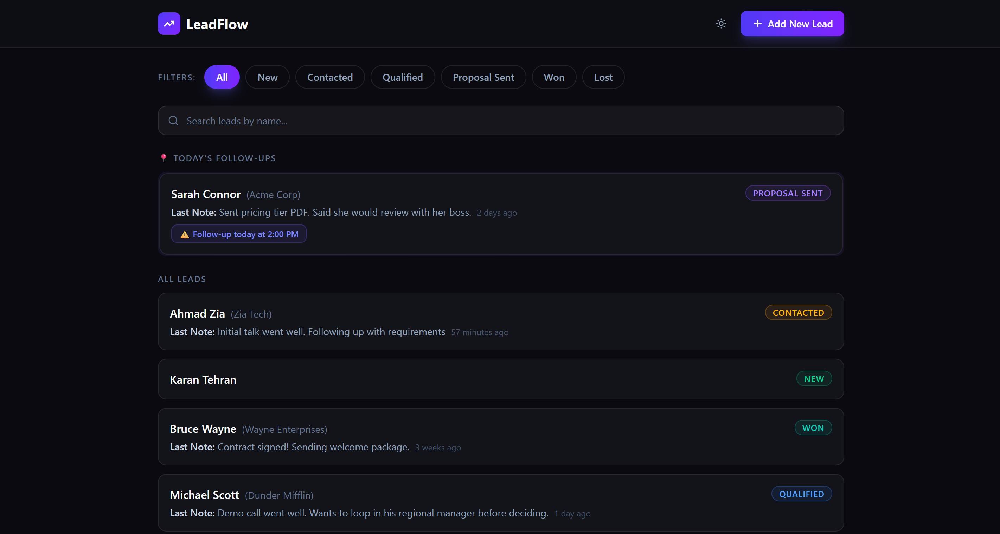
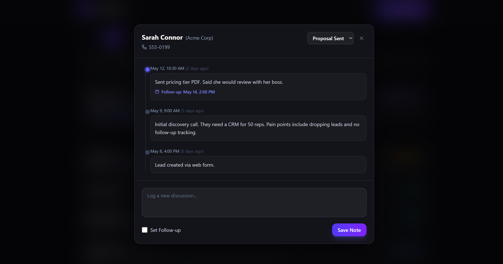
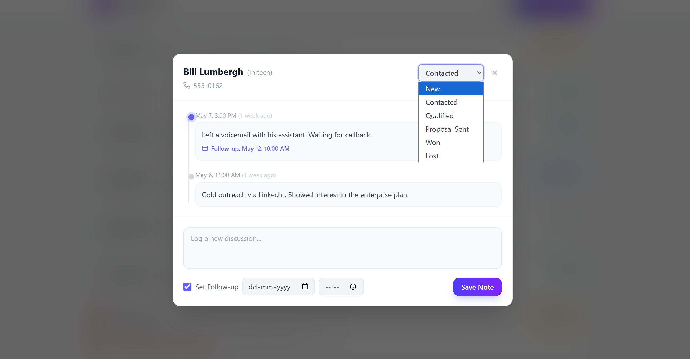
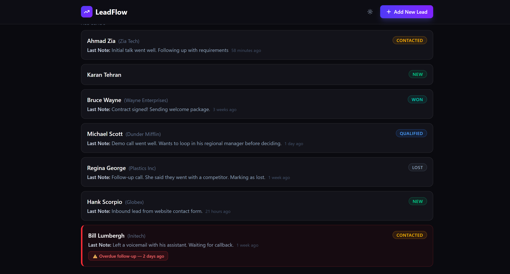
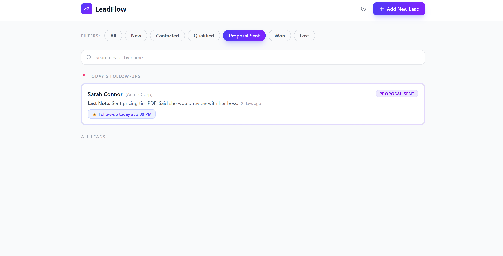

# LeadFlow

> A lightweight CRM for sales reps — track leads, log discussions, and never miss a follow-up.



---

## Features

- 📌 Today's follow-ups pinned at the top
- 🔴 Overdue follow-ups highlighted automatically
- 🏷️ Filter leads by status — New, Contacted, Qualified, Proposal Sent, Won, Lost
- 🔍 Search leads by name
- 🗂️ Full discussion timeline per lead
- 📝 Log notes with optional follow-up date and time
- ✏️ Update lead status inline from the timeline dialog
- ➕ Add new leads in seconds
- 🌙 Dark / Light mode toggle
- 🐳 Fully Dockerized — one command to run everything

---

## Screenshots

<table>
  <tr>
    <td><br/><sub>Lead list — light mode</sub></td>
    <td><br/><sub>Lead list — dark mode</sub></td>
  </tr>
  <tr>
    <td><br/><sub>Timeline dialog — dark mode</sub></td>
    <td><br/><sub>Timeline dialog — light mode</sub></td>
  </tr>
  <tr>
    <td><br/><sub>Overdue follow-up highlight</sub></td>
    <td><br/><sub>Status filter</sub></td>
  </tr>
</table>

---

## Tech Stack

| Layer | Technology |
|---|---|
| Frontend | React 19, Tailwind CSS v4, Redux Toolkit, React Query |
| Backend | Node.js, Express.js |
| Database | MongoDB (Atlas or Docker) |
| DevOps | Docker Compose |

---

## Project Structure

```
leadflow/
├── backend/
│   ├── config/          # Database connection
│   ├── controllers/     # Route handlers
│   ├── middleware/      # Error handler
│   ├── models/          # Mongoose models
│   ├── routes/          # Express routes
│   ├── seed/            # Seed script
│   └── utils/           # apiError, apiResponse, asyncHandler
├── frontend/
│   ├── src/
│   │   ├── components/  # UI components
│   │   ├── hooks/       # React Query hooks
│   │   ├── pages/       # Home page
│   │   ├── services/    # Axios instance and API calls
│   │   ├── store/       # Redux store and slices
│   │   └── utils/       # Helper functions
├── assets/
│   └── screenshots/     # README screenshots
└── docker-compose.yml
```

---

## Prerequisites

- Node.js v20+
- Docker Desktop (for Docker setup)
- MongoDB Atlas account (for local setup)

---

## Option A — Run with Docker *(Recommended)*

```bash
# 1. Clone the repo
git clone https://github.com/yourusername/leadflow.git
cd leadflow

# 2. Create the backend env file
**Backend:**
```bash
cp .env.example backend/.env
# Fill in your MONGODB_URI

**Frontend:**
```bash
echo "VITE_API_BASE_URL=http://localhost:8000/api/v1" > frontend/.env
```

# 3. Start all services

```
docker compose up --build

Then in a new terminal, seed the database:

```bash
cd backend
npm install
npm run seed:docker
```

> **Windows Users:** If you encounter a build error mentioning 
> `invalid file request`, run these two commands separately, then seed the database:
> ```cmd
> set DOCKER_BUILDKIT=0
> docker compose up --build
> ```

Open the app:
- Frontend → http://localhost:5173
- API health → http://localhost:8000/api/v1/health

---

## Option B — Run Locally

```bash
# 1. Clone the repo
git clone https://github.com/yourusername/leadflow.git
cd leadflow

# 2. Backend setup
cd backend
npm install
cp .env.example .env
# Edit .env with your MongoDB Atlas URI

npm run seed   # seed the database
npm run dev    # start the backend
```

```bash
# 3. Frontend setup (new terminal)
cd frontend
npm install
# Create frontend/.env with:
# VITE_API_BASE_URL=http://localhost:8000/api/v1

npm run dev
```

Open the app → http://localhost:5173

---

## Environment Variables

See `.env.example` for all required variables.

### Backend

| Variable | Description | Example |
|---|---|---|
| `PORT` | Server port | `8000` |
| `MONGODB_URI` | MongoDB Atlas connection string | `mongodb+srv://...` |
| `MONGODB_URI_DOCKER` | MongoDB URI for Docker | `mongodb://mongodb:27017/leadflow` |
| `MONGODB_URI_LOCAL_DOCKER` | URI for seeding Docker DB locally | `mongodb://localhost:27017/leadflow` |
| `NODE_ENV` | Environment | `development` |
| `CORS_ORIGIN` | Frontend URL | `http://localhost:5173` |

### Frontend

| Variable | Description | Example |
|---|---|---|
| `VITE_API_BASE_URL` | Backend API base URL | `http://localhost:8000/api/v1` |

---

## Seed Data

The seed script creates 6 leads covering all status and follow-up scenarios.

| Lead | Status | Follow-up |
|---|---|---|
| Sarah Connor | Proposal Sent | Today — tests pinning |
| Hank Scorpio | New | None |
| Bill Lumbergh | Contacted | 2 days ago — tests overdue |
| Bruce Wayne | Won | None |
| Michael Scott | Qualified | Tomorrow |
| Regina George | Lost | None |

---

## API Reference

### Leads

| Method | Endpoint | Description |
|---|---|---|
| `GET` | `/api/v1/leads` | Get all leads (supports `?status=` and `?search=`) |
| `GET` | `/api/v1/leads/:id` | Get lead by ID |
| `POST` | `/api/v1/leads` | Create a new lead |
| `PATCH` | `/api/v1/leads/:id` | Update lead status or follow-up |
| `DELETE` | `/api/v1/leads/:id` | Delete lead and its discussions |

### Discussions

| Method | Endpoint | Description |
|---|---|---|
| `GET` | `/api/v1/leads/:leadId/discussions` | Get all discussions for a lead |
| `POST` | `/api/v1/leads/:leadId/discussions` | Add a discussion note |

---
